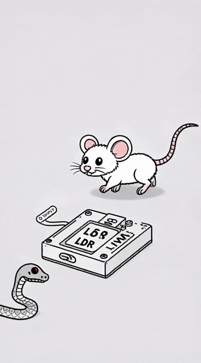

*Demo: Cartoonish line art animation showing the rodent detector in action.*

# Rodent Detector using LDR

## Project Overview
This project is an automated rodent (and optionally snake) detection system using a Light Dependent Resistor (LDR) sensor, designed to monitor and count the entry and exit of rodents in a specified area. The system is implemented using Arduino and provides real-time feedback via the serial monitor.

## Features
- Detects movement using an LDR sensor.
- Counts the number of rodents (and optionally snakes) entering and leaving the monitored area.
- Differentiates between rodents and snakes based on the duration of movement (in the advanced version).
- Outputs detection events and counts to the serial monitor.

## Hardware Requirements
- Arduino board (Uno, Nano, etc.)
- LDR (Light Dependent Resistor) sensor
- Resistor (typically 10kΩ for voltage divider with LDR)
- Jumper wires
- Breadboard
- USB cable for programming and serial monitoring

## Setup Instructions
1. **Circuit Assembly:**
   - Connect the LDR and resistor in a voltage divider configuration.
   - Connect the output of the divider to analog pin A0 on the Arduino.
   - Power the circuit using the Arduino's 5V and GND pins.
2. **Programming:**
   - Use the provided Arduino sketches (`sketch_apr18a.ino` or `sketch_apr18c.ino`).
   - Upload the desired sketch to your Arduino board using the Arduino IDE.
3. **Monitoring:**
   - Open the Serial Monitor in the Arduino IDE (baud rate: 9600) to view detection events and counts.

## Usage
- When a rodent (or other object) passes in front of the LDR, the system detects the change in light and logs the event.
- The count is incremented each time a rodent leaves the area.
- In the advanced version, the system attempts to distinguish between rodents and snakes based on how long the object blocks the sensor.

## Arduino Sketches
### 1. `sketch_apr18a.ino`
- Basic version: Detects movement and counts rodents entering and leaving the area.
- Outputs messages to the serial monitor when movement is detected and when a rodent leaves.

### 2. `sketch_apr18c.ino`
- Advanced version: Adds timing logic to differentiate between rodents and snakes.
- If the object blocks the sensor for less than 1 second, it is counted as a rodent.
- If the object blocks the sensor for 1-3 seconds, it is counted as a snake.
- Outputs the respective counts and messages to the serial monitor.

## Notes
- Adjust the `sensorThreshold` value in the sketches if detection is unreliable (depends on ambient light and sensor setup).
- Ensure the LDR is positioned where rodents/snakes are likely to pass.

## License
This project is for educational and research purposes. Modify and use as needed for your application. 